<div align="center">

# 🧩 DevHub

**개발자를 위한 UI·코드 공유 커뮤니티**

게시판 · 실시간 채팅 · AI 챗봇 · 코드/UI 공유 · 포인트 결제를 한 곳에서

<br/>


<br/>


</div>

<br/>

## 목차

- [📖 소개](#-소개)
- [🚀 실행 방법](#-실행-방법)
- [🧰 기술 스택](#-기술-스택)
- [🧱 시스템 아키텍처](#-시스템-아키텍처)
- [📸 주요 기능](#-주요-기능)
- [⭐ My Contributions](#-my-contributions)
- [🐞 트러블슈팅](#-트러블슈팅)
- [🔧 개선 내역](#-개선-내역)
- [📝 알려진 한계](#-알려진-한계)
- [👥 팀 구성](#-팀-구성)

<br/>

## 📖 소개

**DevHub**는 프리랜서와 개발자를 위한 커뮤니티 플랫폼입니다. 회원들은 게시판으로 지식·코드를 공유하고, 오픈소스 UI 요소를 가져다 쓰며, 팀 프로젝트에 참여할 수 있습니다. 실시간 채팅과 AI 챗봇으로 소통하고, 출석·포인트로 활동을 이어갑니다.

- 🧑‍💻 **커뮤니티** — 게시판(코드 첨부), 실시간 채팅, AI 챗봇
- 🧩 **코드/UI 공유** — CodeMirror 편집기 + 복사 가능한 오픈소스 UI 컴포넌트
- 💳 **포인트 경제** — 출석 적립 + 카카오페이 충전으로 코드 열람
- 👥 **협업** — 팀 모집·이력서 제출

> 👤 **팀 5인 · 2024.06 ~ 2024.07 · 부트캠프 파이널 프로젝트** — 담당: **이상혁**

<br/>

## 🚀 실행 방법

Oracle 설치 없이 **H2 인메모리 프로파일**로 바로 실행됩니다(데모 데이터 자동 주입).

```bash
git clone <repository-url>
cd Devhub
./gradlew bootRun --args="--spring.profiles.active=h2"
# 👉 http://localhost:9091
```

**데모 계정** (비밀번호 모두 `1234`)

| 아이디 | 비고 |
|---|---|
| `backpark` | 포인트 보유 최다 (결제/마이페이지 데모용) |
| `devkim` · `codinglee` · `frontchoi` | 일반 회원 |

> 운영(Oracle)은 `application-secret.properties` 에 DB·메일 정보를 주입합니다. (이 파일은 `.gitignore` 처리 — `application-secret.properties.example` 참고)

<br/>

## 🧰 기술 스택

| 구분 | 기술 |
|---|---|
| **Language** |  |
| **Framework** |   |
| **Persistence** |    |
| **View / Front** |     |
| **실시간** |  |
| **External API** | Google Dialogflow · iamport(KakaoPay) · ipinfo · CodeMirror · Quill |
| **Build** |  |

<br/>

## 🧱 시스템 아키텍처

전형적인 **계층형(Layered) 구조**로, 요청은 `Controller → Service → Repository → Entity` 순으로 흐릅니다. Service 계층에 트랜잭션 경계를 두고, 외부 API(챗봇·결제·위치)는 Service에서 호출합니다.

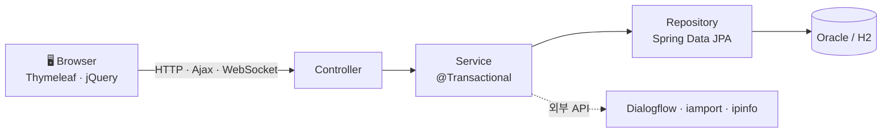

<br/>

## 📸 주요 기능

<table>
<tr>
<td width="50%">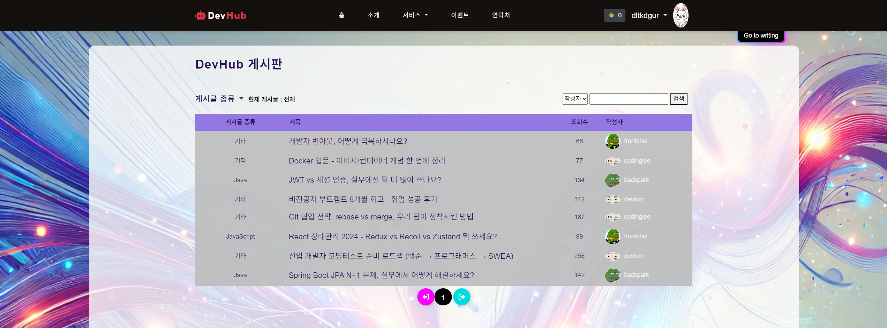<br/><b>게시판</b> — 코드 첨부 글쓰기·댓글</td>
<td width="50%">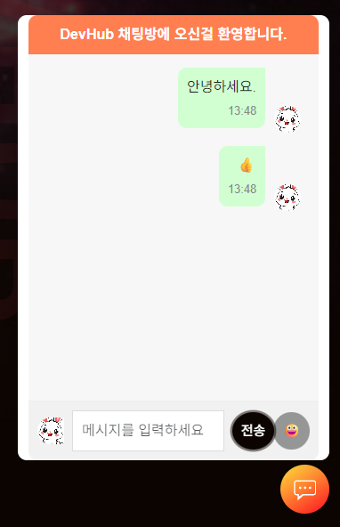<br/><b>실시간 채팅</b> — WebSocket 전체 채팅방</td>
</tr>
<tr>
<td width="50%">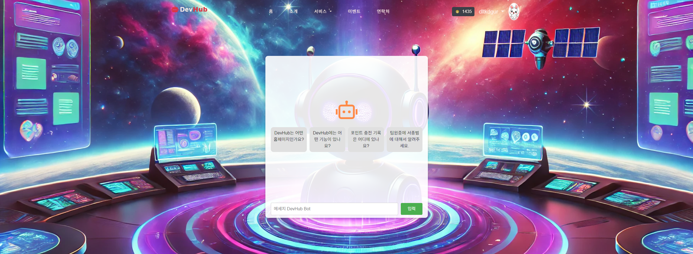<br/><b>AI 챗봇</b> — Dialogflow 안내봇</td>
<td width="50%"><br/><b>코드/UI 공유</b> — 복사 가능한 컴포넌트</td>
</tr>
<tr>
<td width="50%">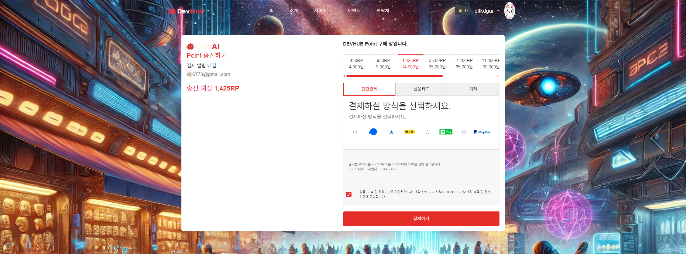<br/><b>포인트 충전</b> — 카카오페이 결제</td>
<td width="50%">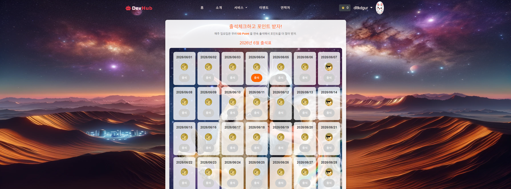<br/><b>출석체크</b> — 달력 출석 + 포인트</td>
</tr>
</table>

<br/>

## ⭐ My Contributions

> 팀 프로젝트에서 **제가 직접 구현/연동한 부분**입니다. 각 항목에 실제 코드 위치와 핵심 코드를 함께 적었습니다.
> (팀 모집·이력서 모듈은 다른 팀원 담당으로, 아래 목록에서 제외했습니다.)

### 1. 회원가입 · 로그인 (프론트 + 백엔드)

이메일 인증 기반 회원가입과 세션 로그인 흐름을 **화면부터 서버 로직까지** 전부 구현했습니다. 비밀번호는 BCrypt로 해싱합니다.

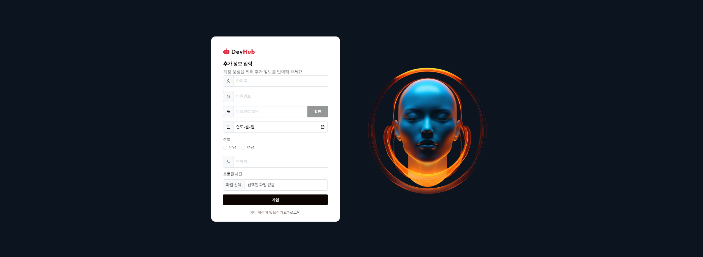 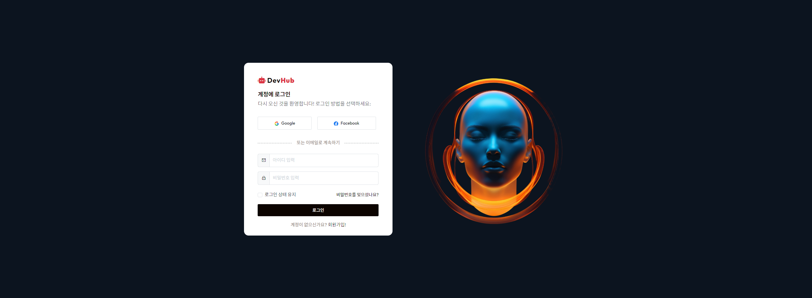

```java
// MemberService.mLogin() — BCrypt 검증 후 세션에 로그인 정보 저장
if (pwEnc.matches(member.getMPw(), entity.get().getMPw())) {
    session.setAttribute("loginId", login.getMId());
    session.setAttribute("loginProfile", login.getMProfileName());
    session.setAttribute("loginName", login.getMName());
}
```
📁 `MemberController` · `MemberService` · `templates/member/signup.html` · `login.html`

### 2. Spring Security — 인증 / 인가

세션 기반 커스텀 로그인을 **Spring Security와 연결**했습니다. 매 요청의 세션을 인증 주체로 올리는 브릿지 필터를 만들고, 민감 경로(회원수정·결제·글쓰기 등)는 로그인 필수로 보호합니다.

```java
// securityConfig.java — 민감 경로 인증 필수 + 세션→SecurityContext 브릿지
http.authorizeHttpRequests(auth -> auth
        .requestMatchers("/mModify", "/mDelete", "/bWrite", "/charge", "/attend", ...).authenticated()
        .anyRequest().permitAll())
   .addFilterBefore(new SessionAuthenticationFilter(),
                    UsernamePasswordAuthenticationFilter.class);
```
📁 `config/securityConfig.java` · `config/SessionAuthenticationFilter.java`

### 3. 실시간 채팅 — WebSocket (STOMP)

SockJS + STOMP로 메시지를 `/topic/public`에 브로드캐스트하는 전체 공개 채팅방.

 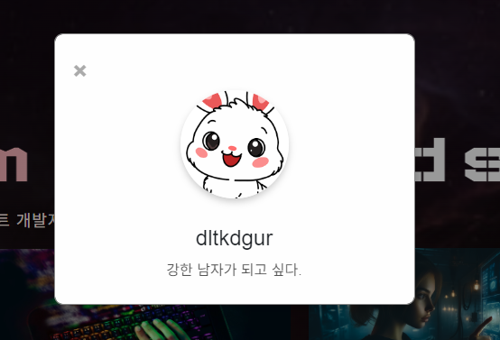

```java
// ChatController.java — 받은 메시지를 구독자 전체에게 전달
@MessageMapping("/chat.sendMessage")
@SendTo("/topic/public")
public ChatMessage sendMessage(@Payload ChatMessage chatMessage) {
    return chatMessage;
}
```
📁 `ChatController` · `config/WebSocketConfig` · `static/js/chat.js` · `templates/body/chat.html`

### 4. 포인트 충전 (결제 프론트) + 카카오페이 연동

충전 금액·결제수단 선택 UI를 설계하고, **iamport(아임포트)로 카카오페이 결제**를 붙였습니다.

 

```javascript
// payment.js — iamport 로 카카오페이 결제 요청
IMP.init("imp11615807");
IMP.request_pay({
    pg: 'kakaopay',
    pay_method: 'card',
    merchant_uid: 'merchant_' + new Date().getTime(),
    amount: price
}, callback);
```
📁 `static/js/payment.js` · `templates/pointPayment.html` · `OrderController` · `OrderService`

### 5. 출석체크 + 포인트 적립

하루 1회 출석 시 포인트를 적립하고(중복 방지), 일요일 보너스를 줍니다.

 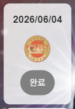 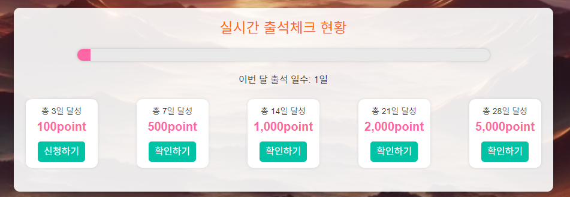

```java
// EventService.event() — 같은 날짜 중복 출석이면 적립 차단, 적립 포인트는 서버가 결정
boolean already = eventRepository.findByMember_MId(loginId).stream()
        .anyMatch(e -> dto.getIDATE().equals(e.getIDATE()));
if (already) return;
int points = (LocalDate.now().getDayOfWeek() == DayOfWeek.SUNDAY) ? 100 : 10;
```
📁 `EventController` · `EventService` · `templates/attendance.html`

### 6. 내 정보 (마이페이지)

프로필·계정 정보 + 로그인 기록 / 구매 내역 / 회원 수정 진입.

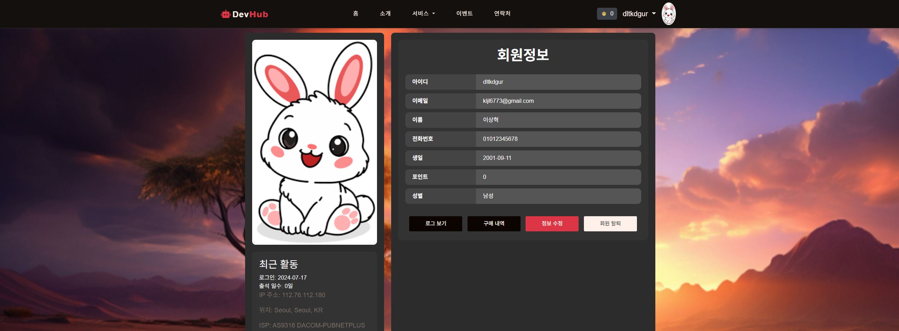

```java
// MemberController.java
@GetMapping("/mView/{MId}")
public ModelAndView mView(@PathVariable("MId") String MId) {
    return msvc.mView(MId);
}
```
📁 `MemberController` · `MemberService` · `templates/member/view.html`

### 7. 로그인 기록 — ipinfo API

로그인 시 **ipinfo API**로 접속 IP·위치(도시/지역/국가)·ISP를 수집해 로그인 이력으로 저장하고, "로그인 기록" 모달에서 보여줍니다.


```javascript
// ipaddress.js — ipinfo 로 IP/위치/ISP 조회 → /log 로 저장
fetch('https://ipinfo.io/json?token=...')
  .then(res => res.json())
  .then(d => { /* d.ip, d.city, d.region, d.country, d.org → 로그인 이력 저장 */ });
```
📁 `static/js/ipaddress.js` · `LoginEntity` · `LoginDTO` · `MemberService.log()` · `getLoginHistoryByUserId()`

### 8. AI 챗봇 — Google Dialogflow

사용자 메시지를 Dialogflow에 보내 의도를 분석하고 응답하는 안내 챗봇.

 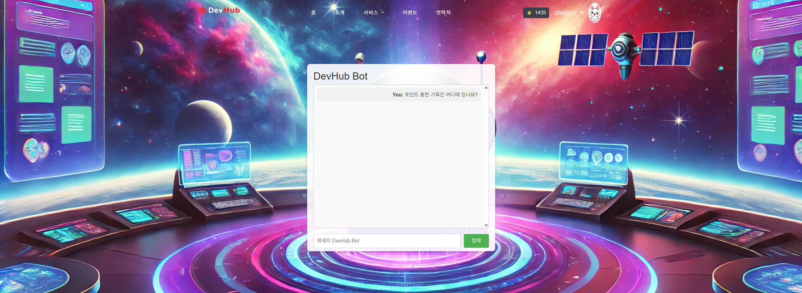

```java
// ChatController.java — 메시지를 Dialogflow 로 전달해 응답
@GetMapping("/chat")
@ResponseBody
public String chat(@RequestParam String message) {
    return dialogflowService.detectIntentTexts(message);
}
```
📁 `ChatController` · `service/DialogflowService` · `config/DialogflowConfig` · `templates/aiChat.html`

### 9. 게시판 — Ajax REST API 연동

게시글 목록/검색/작성/상세/댓글을 Ajax REST로 연동했습니다. (Quill 에디터 + 코드 첨부)

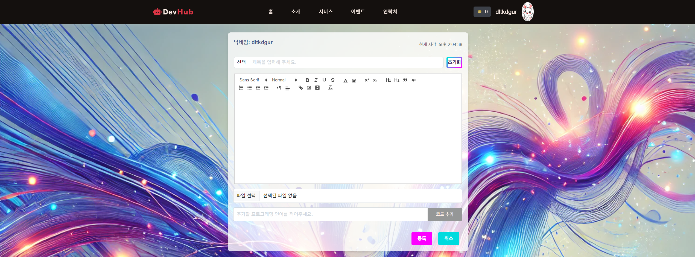 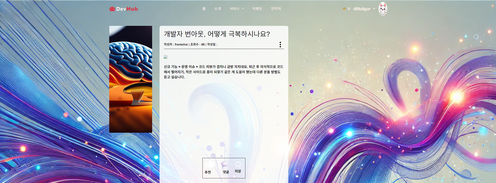

```java
// RestfulController.java — 게시글/댓글 REST
@PostMapping("/boardList")    public List<BoardDTO> boardList() { return bsvc.boardList(); }
@PostMapping("/bWrite")       public String bWrite(@ModelAttribute BoardDTO board) { return bsvc.bWrite(board); }
@PostMapping("/commentWrite") public void commentWrite(@ModelAttribute CommentDTO c) { csvc.commentWrite(c); }
```
📁 `RestfulController` · `BoardController` · `BoardService` · `CommentService` · `templates/board/*.html`

### 10. 코드 생성기 / UI 공유 — CodeMirror

오픈소스 UI 컴포넌트를 미리보고 **CSS/HTML 코드를 복사**하며, CodeMirror로 코드를 하이라이팅·편집합니다.

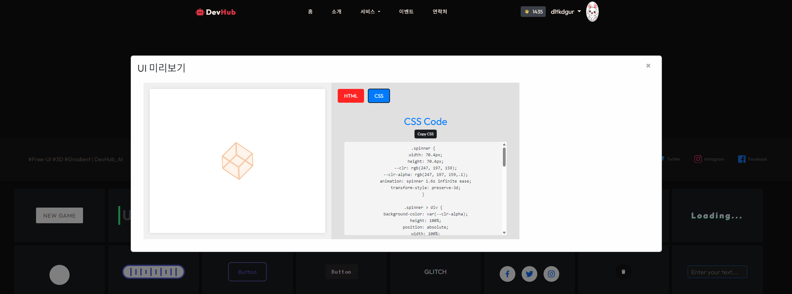 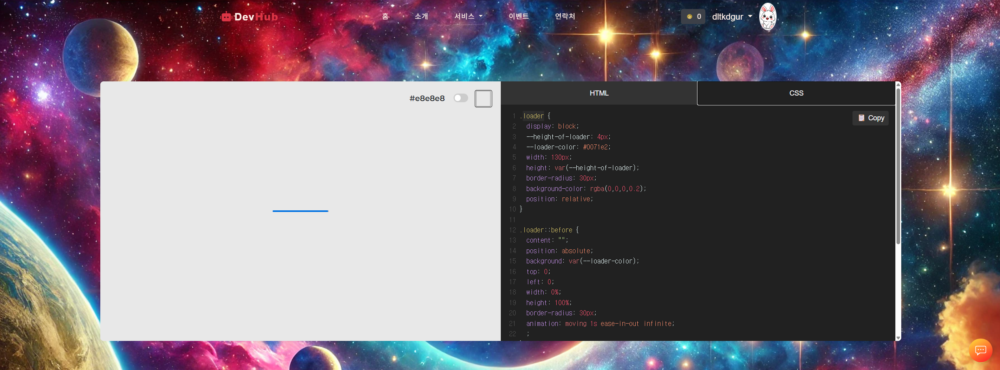

```java
// CodeEntity.java — 게시글에 첨부되는 코드 스니펫
@Column(nullable = false) private String DName;    // 프로그래밍 언어
@Column(length = 10000)   private String DCode;    // 코드 본문
```
📁 `templates/coding.html` (CodeMirror) · `templates/services.html` · `dto/board/CodeEntity`

<br/>

## 🐞 트러블슈팅

<details>
<summary><b>1. 업로드한 프로필 사진이 늦게 뜨는 문제</b></summary>

- **원인**: 파일을 `src/main/resources/static/profile`(소스 폴더)에 저장했는데, 실행 중인 앱은 정적 파일을 `build/...`(classpath)에서 서빙 → 저장 위치와 서빙 위치 불일치로 즉시 표시 안 됨.
- **해결**: 업로드를 **외부 폴더(`uploads/`)** 로 분리하고 `WebMvcConfigurer`의 `ResourceHandler`로 `/profile/**`를 그 폴더에 매핑. 저장=서빙 위치가 같아져 **즉시 표시**, JAR 패키징 후에도 동작.
</details>

<details>
<summary><b>2. Spring Security가 비활성화돼 인증이 안 걸리던 문제</b></summary>

- **원인**: 세션 기반 커스텀 로그인을 쓰느라 SecurityAutoConfiguration을 제외 → 프레임워크 레벨 인가가 전혀 없었음.
- **해결**: 세션의 `loginId`를 `SecurityContext`에 올리는 **브릿지 필터**를 만들어, 커스텀 로그인을 유지하면서 `SecurityFilterChain`으로 민감 경로를 보호.
</details>

<details>
<summary><b>3. 포인트 차감에 음수를 보내면 잔액이 증가하던 버그</b></summary>

- **원인**: `currentPoints - MPoint` 에서 `MPoint`가 음수면 오히려 잔액이 늘고, `currentPoints >= 음수` 조건도 항상 통과.
- **해결**: 차감 금액 `MPoint <= 0` 이면 즉시 거부하도록 서버 검증 추가.
</details>

<br/>

## 🔧 개선 내역

프로젝트 종료 후, 코드 품질·보안을 직접 점검하며 리팩터링했습니다.

- 🔐 노출된 비밀키·비밀번호 분리 (`.gitignore` + 환경 분리)
- 🛡 Spring Security 재적용 (인증/인가 + 세션 브릿지)
- 🔄 Service 계층 **트랜잭션 경계** 추가
- 🐞 로직 버그 수정 (포인트 음수 차감, 게시글 수정 시 조회수 초기화 등)
- 🧹 업로드 경로 외부화, 패키지 네이밍 정리, 죽은 코드 제거

<br/>

## 📝 알려진 한계

향후 개선하고 싶은 부분입니다.

- 결제·포인트 금액의 **서버 측 검증** 강화 (현재 일부 클라이언트 신뢰)
- 모든 수정/삭제에 **소유권 검사**(IDOR 방지) 추가
- WebSocket 메시지 **서버 측 인증** 및 CSRF 토큰 적용
- **테스트 코드 / CI** 도입

<br/>

## 👥 팀 구성

| 팀원 | 역할 |
|---|---|
| **이상혁** (본인) | 회원가입·로그인(프론트+백), Spring Security, 실시간 채팅, 포인트 결제(카카오페이), 출석, 마이페이지, 로그인 기록, AI 챗봇, 게시판 API, 코드 공유 |
| 팀원 4인 | 팀 모집·이력서 모듈, 공통 UI/디자인 등 |

<div align="center">
<br/>
<sub>DevHub · 개발자를 위한 UI·코드 공유 커뮤니티</sub>
</div>
