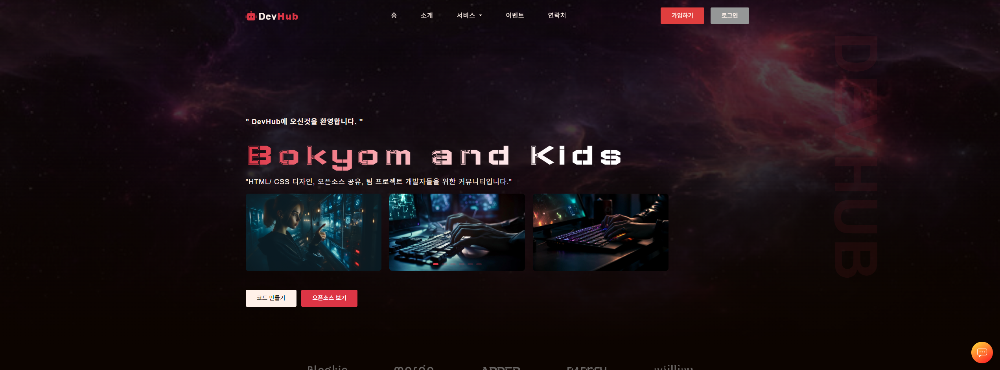
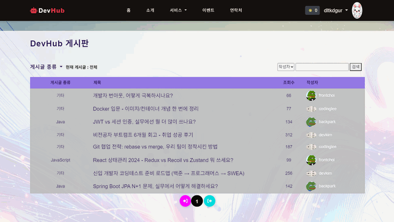
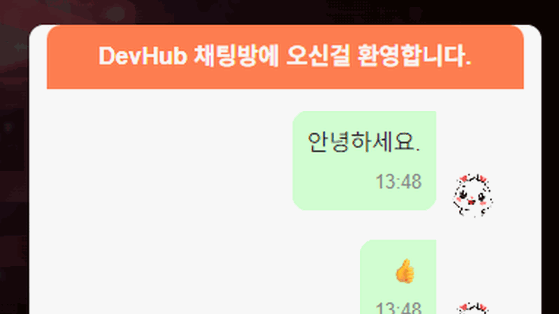
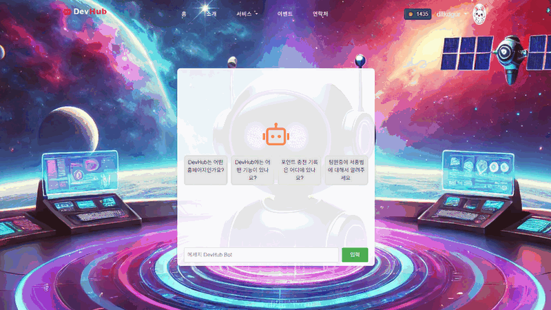
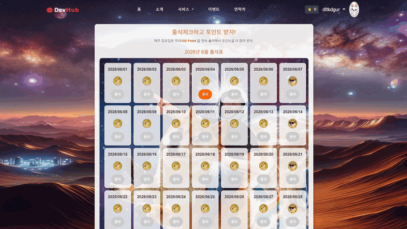
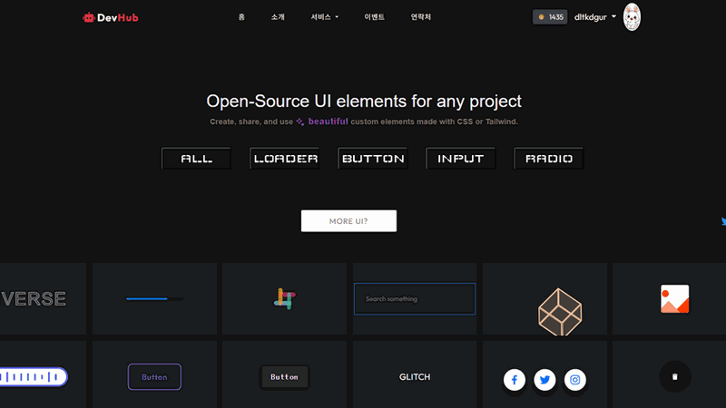
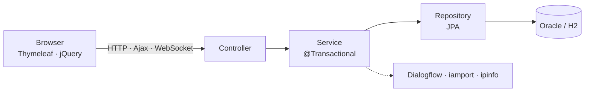
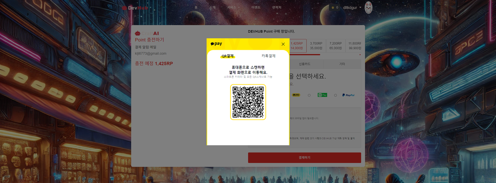
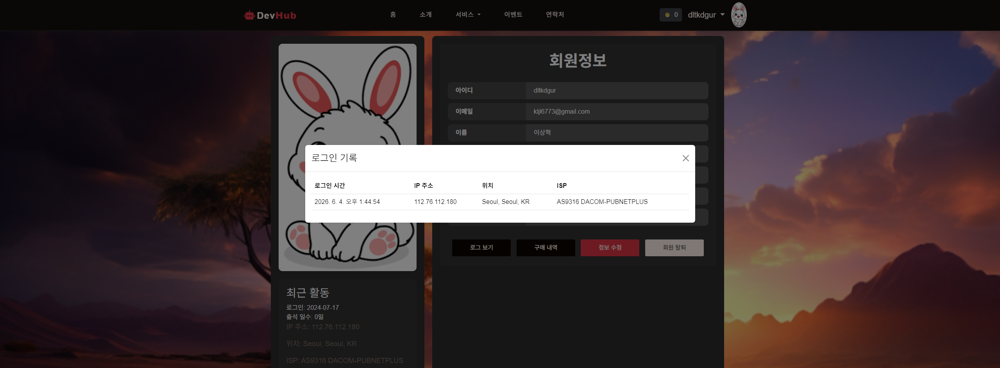

<div align="center">

# DevHub

개발자를 위한 UI·코드 공유 커뮤니티 — 5인 팀 프로젝트 (2024)




</div>

게시판에 코드를 올려 공유하고, 오픈소스 UI 컴포넌트를 가져다 쓰고, 실시간 채팅과 AI 챗봇으로 소통하는 개발자 커뮤니티입니다. 부트캠프 파이널 프로젝트로 5명이 한 달 반 동안 만들었고, 저는 **인증·보안·결제·실시간** 쪽을 주로 맡았습니다.

<details open>
<summary><b>목차</b></summary>

<br>

**시작하기**
- [실행](#실행)
- [기술 스택](#기술-스택)

**기능 & 설계**
- [둘러보기](#둘러보기)
- [시스템 구조](#시스템-구조)
- [프로젝트 구조](#프로젝트-구조)
- [내가 맡은 부분](#내가-맡은-부분)

**회고 & 팀**
- [기억에 남는 문제들](#기억에-남는-문제들)
- [개선 내역](#이후-개선한-것)
- [한계](#한계)
- [팀](#팀)

</details>

## 실행

Oracle 없이 H2로 바로 돌려볼 수 있습니다. 실행하면 데모 데이터가 자동으로 들어갑니다.

```bash
./gradlew bootRun --args="--spring.profiles.active=h2"
```

`http://localhost:9091` · 데모 계정 `backpark / 1234`

## 기술 스택

| 분류 | 기술 | 비고 |
| :--- | :--- | :--- |
| **Language** | Java 21 | |
| **Framework** | Spring Boot 3.3 · Spring Security | 인증 · 인가 |
| **Persistence** | Spring Data JPA / Hibernate · Oracle(운영) · H2(데모) | |
| **View · Front** | Thymeleaf · JavaScript(jQuery) · Bootstrap | 화면은 **Bootstrap 템플릿** 기반 |
| **실시간** | WebSocket (STOMP / SockJS) | 실시간 채팅 |
| **외부 API** | Dialogflow · iamport(KakaoPay) · ipinfo | 챗봇 · 결제 · 위치 |
| **Editor** | CodeMirror · Quill | 코드 편집 · 리치 텍스트 |
| **Build** | Gradle | |

## 둘러보기

<table>
<tr>
<td width="50%"><br><sub>게시판 — 코드 첨부 글쓰기·댓글</sub></td>
<td width="50%"><br><sub>실시간 채팅 (WebSocket)</sub></td>
</tr>
<tr>
<td width="50%"><br><sub>AI 챗봇 (Dialogflow)</sub></td>
<td width="50%"><br><sub>포인트 충전 (카카오페이)</sub></td>
</tr>
<tr>
<td width="50%"><br><sub>출석체크 + 포인트</sub></td>
<td width="50%"><br><sub>코드 / UI 컴포넌트 공유</sub></td>
</tr>
</table>

## 시스템 구조

`Controller → Service → Repository → Entity` 의 계층 구조입니다. 트랜잭션 경계는 Service에 두고, 외부 API(챗봇·결제·위치 조회)도 Service에서 호출합니다.



## 프로젝트 구조

```
src/main/java/com/icia/devhub/
├── controller/   # 요청 처리 (Member · Board · Order · Event · Chat · Team)
├── service/      # 비즈니스 로직 (@Transactional)
├── dao/          # Spring Data JPA Repository
├── dto/          # DTO + Entity (board · member · order · team · event · coupon)
└── config/       # Security · WebSocket · Dialogflow · 파일 업로드 설정

src/main/resources/
├── templates/    # Thymeleaf 뷰
├── static/       # JS · CSS · 이미지 · libs (Bootstrap)
└── application.properties · application-h2.properties (H2 데모)
```

## 내가 맡은 부분

팀에서 역할을 나눠 작업했고, 아래는 제가 직접 구현한 부분입니다. (팀 모집·이력서 모듈은 다른 팀원이 맡았습니다.)

### 회원가입 · 로그인 (프론트 + 백엔드)

이메일 인증 회원가입과 세션 로그인을 화면부터 서버 로직까지 구현했습니다. 비밀번호는 BCrypt로 해싱하고, 로그인에 성공하면 세션에 사용자 정보를 담아 이후 페이지에서 씁니다.

```java
// MemberService.mLogin()
if (pwEnc.matches(member.getMPw(), entity.get().getMPw())) {
    session.setAttribute("loginId", login.getMId());
    session.setAttribute("loginProfile", login.getMProfileName());
    session.setAttribute("loginName", login.getMName());
}
```
`MemberController` `MemberService` `member/signup.html` `member/login.html`

### Spring Security

세션 기반 커스텀 로그인을 쓰다 보니 처음엔 Security를 꺼뒀는데, 그러면 프레임워크 차원의 인가가 전혀 없었습니다. 매 요청의 세션 `loginId`를 `SecurityContext`로 올리는 브릿지 필터를 만들어, 기존 로그인 흐름을 그대로 두면서 민감한 경로(회원 수정·삭제, 결제, 글쓰기 등)를 로그인 사용자에게만 열었습니다.

```java
// securityConfig.java
http.authorizeHttpRequests(auth -> auth
        .requestMatchers("/mModify", "/mDelete", "/bWrite", "/charge", "/attend", ...).authenticated()
        .anyRequest().permitAll())
   .addFilterBefore(new SessionAuthenticationFilter(),
                    UsernamePasswordAuthenticationFilter.class);
```
`config/securityConfig.java` `config/SessionAuthenticationFilter.java`

### 실시간 채팅 (WebSocket)

SockJS + STOMP로 메시지를 `/topic/public` 에 브로드캐스트하는 공개 채팅방입니다. 보낸 사람 프로필을 누르면 카드가 뜹니다.

```java
// ChatController.java
@MessageMapping("/chat.sendMessage")
@SendTo("/topic/public")
public ChatMessage sendMessage(@Payload ChatMessage chatMessage) {
    return chatMessage;
}
```
`ChatController` `config/WebSocketConfig` `static/js/chat.js` `body/chat.html`

### 포인트 충전 + 카카오페이 연동

충전 금액과 결제수단을 고르는 화면을 만들고, iamport로 카카오페이 결제를 붙였습니다.



```javascript
// payment.js
IMP.init("imp11615807");
IMP.request_pay({
    pg: 'kakaopay', pay_method: 'card',
    merchant_uid: 'merchant_' + new Date().getTime(), amount: price
}, callback);
```
`static/js/payment.js` `pointPayment.html` `OrderController` `OrderService`

### 출석체크

하루 한 번 출석하면 포인트를 주고, 같은 날 중복 적립은 막습니다. 일요일이면 100, 평일이면 10포인트입니다.

```java
// EventService.event()
boolean already = eventRepository.findByMember_MId(loginId).stream()
        .anyMatch(e -> dto.getIDATE().equals(e.getIDATE()));
if (already) return;
int points = (LocalDate.now().getDayOfWeek() == DayOfWeek.SUNDAY) ? 100 : 10;
```
`EventController` `EventService` `attendance.html`

### 로그인 기록 (ipinfo API)

로그인할 때 ipinfo로 접속 IP·위치·ISP를 받아 로그인 이력으로 남기고, 마이페이지의 "로그인 기록"에서 보여줍니다.



```javascript
// ipaddress.js — ipinfo 조회 후 /log 로 저장
fetch('https://ipinfo.io/json?token=...')
  .then(res => res.json())
  .then(d => { /* d.ip, d.city, d.region, d.country, d.org */ });
```
`static/js/ipaddress.js` `LoginEntity` `MemberService.log()` `getLoginHistoryByUserId()`

### AI 챗봇 (Dialogflow)

사용자 메시지를 Google Dialogflow로 보내 의도를 분석하고 답하는 안내 챗봇입니다.

```java
// ChatController.java
@GetMapping("/chat")
@ResponseBody
public String chat(@RequestParam String message) {
    return dialogflowService.detectIntentTexts(message);
}
```
`ChatController` `DialogflowService` `DialogflowConfig` `aiChat.html`

### 내 정보 (마이페이지)

프로필과 계정 정보에 더해 로그인 기록·구매 내역·회원 수정으로 들어갑니다.
`MemberController(/mView/{MId})` `member/view.html`

### 게시판 API 연동

게시글 목록·검색·작성·상세·댓글을 Ajax REST로 연결했습니다. 글쓰기는 Quill 에디터에 코드 첨부를 지원합니다.

```java
// RestfulController.java
@PostMapping("/boardList")    public List<BoardDTO> boardList() { return bsvc.boardList(); }
@PostMapping("/bWrite")       public String bWrite(@ModelAttribute BoardDTO board) { return bsvc.bWrite(board); }
@PostMapping("/commentWrite") public void commentWrite(@ModelAttribute CommentDTO c) { csvc.commentWrite(c); }
```
`RestfulController` `BoardController` `BoardService` `CommentService` `board/*.html`

### 코드 편집기 (CodeMirror)

게시글에 코드를 첨부할 때 CodeMirror로 언어별 문법 하이라이팅을 지원하고, 코드 스니펫은 언어와 본문을 나눠 저장합니다.
`coding.html` `dto/board/CodeEntity`

## 기억에 남는 문제들

**프로필 사진이 한 박자 늦게 떴다.** 업로드 파일을 `src` 폴더에 저장했는데 실행 중인 서버는 `build` 폴더(classpath)에서 정적 파일을 읽고 있었다. 두 위치가 달라서 방금 올린 사진이 바로 안 보였다. 저장과 서빙 위치를 외부 `uploads` 폴더로 통일하고 `ResourceHandler`로 매핑하니 바로 뜨고, JAR로 묶어도 동작한다.

**음수를 보내면 포인트가 오히려 늘었다.** 차감은 `현재 - 차감액` 인데 차감액이 음수면 더해지는 셈이었고, `현재 >= 음수` 조건도 항상 통과했다. 차감 값이 0 이하면 막도록 검증을 넣었다.

**Security를 켜니 앱이 전부 막혔다.** 세션 커스텀 로그인을 쓰는데 Spring Security엔 인증 주체가 없어 로그인한 사용자까지 차단됐다. 세션을 `SecurityContext`로 올리는 필터를 끼워 둘을 연결했다.

## 이후 개선한 것

프로젝트가 끝난 뒤 코드를 다시 보며 정리했습니다.

- 노출돼 있던 키·비밀번호를 설정에서 분리하고 `.gitignore` 정비
- 비활성화돼 있던 Spring Security 재적용 (인가 + 세션 브릿지)
- Service 계층 트랜잭션 경계 추가
- 포인트 음수 차감, 게시글 수정 시 조회수 초기화 등 로직 버그 수정
- 업로드 경로 외부화, 패키지 네이밍 정리

## 한계

- 결제·포인트 금액의 서버 측 검증 강화 (일부 클라이언트 값에 의존)
- 수정·삭제 시 소유권 검사 추가
- WebSocket 메시지 인증, CSRF 적용
- 테스트 코드 / CI 도입

## 팀

화면은 **Bootstrap 템플릿**을 기반으로 구성한 5인 팀 프로젝트입니다.

| 프로필 | 멤버 | 담당 |
| :---: | :---: | :--- |
| <a href="https://github.com/SanghyeokLee-KR"></a> | **[이상혁](https://github.com/SanghyeokLee-KR)**<br>*(본인)* | 회원가입·로그인(프론트+백), Spring Security, 실시간 채팅, 포인트 충전·카카오페이, 출석체크, 마이페이지, 로그인 기록(ipinfo), AI 챗봇, 게시판 API 연동, 코드 편집기(CodeMirror) |
| — | **김보겸** | Bootstrap 템플릿 페이지 정리·네이밍, 소개·문의하기 |
| — | **유기민** | HTML/CSS UI 컴포넌트 판매 페이지 |
| — | **하진철** | 게시판, 구인구직(팀 모집·이력서) |
